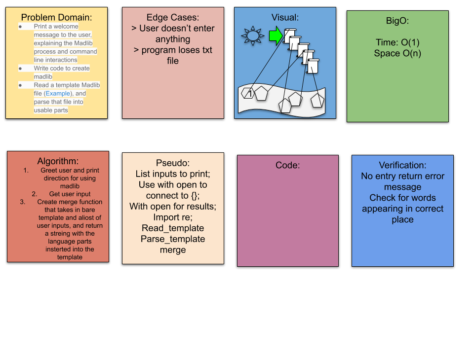

Lab: 03 - Errors, Files, and Packaging
Author: Audrena Vacirca

Description
A madlibs game all ran on your very own python console!
We did this by reading the txt files and replacing super cool placeholders with your super cool ideas!

To use this you will want to: 

Change Log
1.1: Madlib inputs and story functional - 12/13/2020
1.2: Created tests functions with passing results - 12/13/2020
1.3: creates file with results - 12/13/2020

[PR Link](https://github.com/NyxofDarkness/madlib-cli/pull/1)

Collaborators
